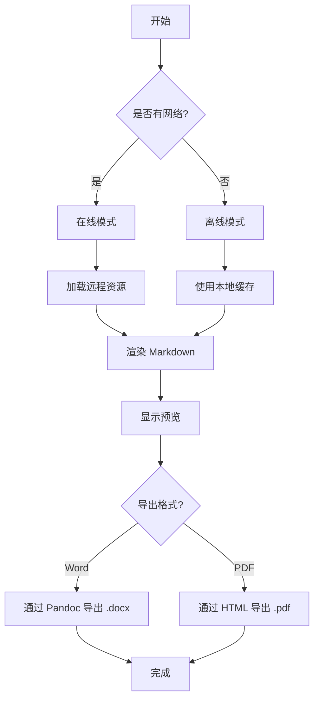
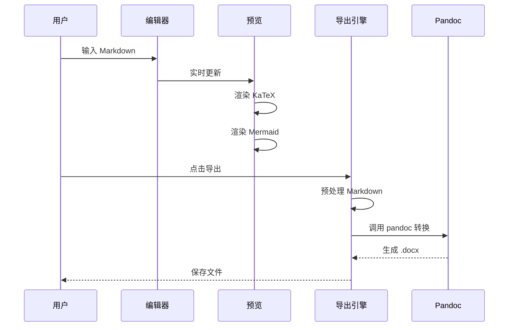
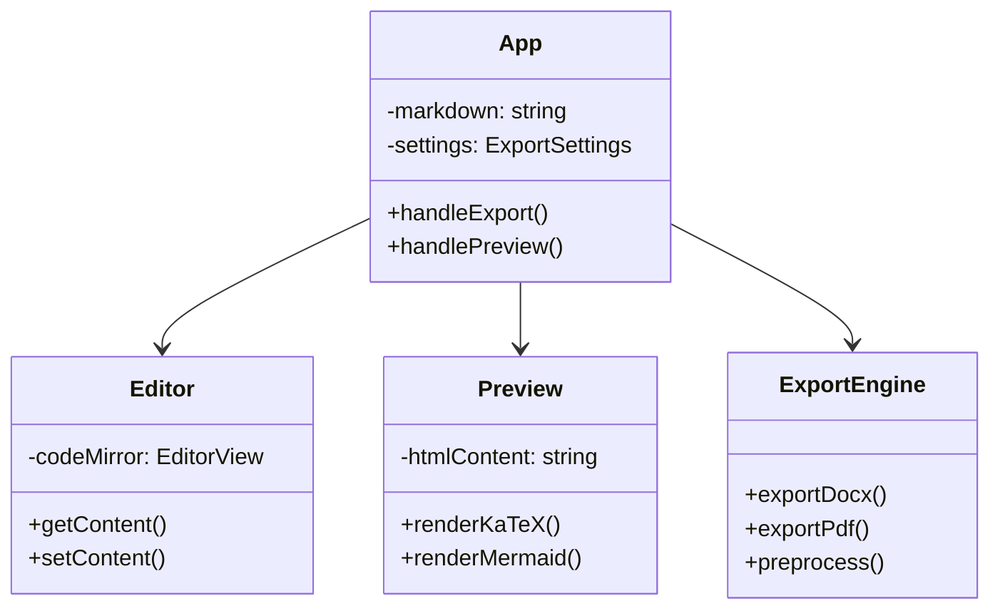
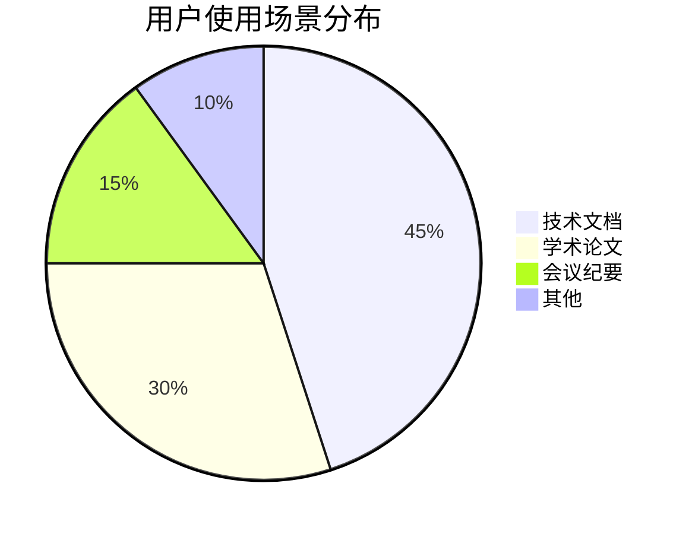

# Markdown 转 Word/PDF 测试样例

本文件用于测试 Markdown 转 Word/PDF 应用的所有功能特性。

---

## 1. 文本格式

这段文字包含 **粗体**、*斜体*、***粗斜体***、~~删除线~~ 和 `行内代码`。

上标: X², 下标: H₂O

---

## 2. 数学公式 (KaTeX)

行内公式: 爱因斯坦的质能方程 $E = mc^2$ 是物理学中最著名的公式。

麦克斯韦方程组:

$$
\begin{aligned}
\nabla \cdot \mathbf{E} &= \frac{\rho}{\varepsilon_0} \\
\nabla \cdot \mathbf{B} &= 0 \\
\nabla \times \mathbf{E} &= -\frac{\partial \mathbf{B}}{\partial t} \\
\nabla \times \mathbf{B} &= \mu_0 \mathbf{J} + \mu_0 \varepsilon_0 \frac{\partial \mathbf{E}}{\partial t}
\end{aligned}
$$

傅里叶变换:

$$
\hat{f}(\xi) = \int_{-\infty}^{\infty} f(x) e^{-2\pi i x \xi} \, dx
$$

薛定谔方程:

$$
i\hbar\frac{\partial}{\partial t}|\Psi(t)\rangle = \hat{H}|\Psi(t)\rangle
$$

---

## 3. Mermaid 图表

### 3.1 流程图



### 3.2 时序图



### 3.3 类图



### 3.4 饼图



---

## 4. 代码高亮

### Python

```python
import numpy as np
from typing import List, Optional

class MarkdownConverter:
    """Markdown 转换器，支持多种格式导出"""

    def __init__(self, pandoc_path: Optional[str] = None):
        self.pandoc_path = pandoc_path or "pandoc"

    def convert_to_docx(self, markdown: str, output: str) -> bool:
        """将 Markdown 转换为 Word 文档

        Args:
            markdown: Markdown 源文本
            output: 输出文件路径

        Returns:
            是否转换成功
        """
        import subprocess
        import tempfile

        with tempfile.NamedTemporaryFile(
            mode='w', suffix='.md', delete=False, encoding='utf-8'
        ) as f:
            f.write(markdown)
            md_path = f.name

        result = subprocess.run(
            [self.pandoc_path, md_path, '-o', output,
             '--from', 'markdown+tex_math_dollars'],
            capture_output=True, text=True
        )
        return result.returncode == 0
```

### JavaScript / TypeScript

```typescript
interface ExportSettings {
  pageSize: 'A4' | 'Letter' | 'A3';
  margins: number;
  editorFontSize: number;
  renderMermaid: boolean;
  codeHighlight: boolean;
  autoOpen: boolean;
  toc: boolean;
}

async function exportDocument(
  markdown: string,
  format: 'docx' | 'pdf',
  settings: ExportSettings
): Promise<void> {
  try {
    const result = await invoke('export_docx', {
      markdown,
      outputPath: 'output.docx',
      settings,
    });

    if (result.success) {
      console.log(`导出成功: ${result.path}`);
    } else {
      console.error(`导出失败: ${result.error}`);
    }
  } catch (error) {
    console.error('导出异常:', error);
  }
}
```

### Rust

```rust
use std::path::PathBuf;
use std::process::Command;
use serde::{Deserialize, Serialize};

#[derive(Debug, Serialize, Deserialize)]
pub struct ExportResult {
    pub success: bool,
    pub path: Option<String>,
    pub error: Option<String>,
}

pub fn find_pandoc() -> Option<PathBuf> {
    // 先查找捆绑的 pandoc
    let bundled = PathBuf::from("resources/bin/pandoc.exe");
    if bundled.exists() {
        return Some(bundled);
    }
    // 再查找系统 PATH
    which::which("pandoc").ok()
}
```

### Java

```java
public class ExportService {
    private final Path pandocPath;

    public ExportService(Path pandocPath) {
        this.pandocPath = pandocPath;
    }

    public CompletableFuture<ExportResult> exportDocxAsync(
            String markdown, Path output) {
        return CompletableFuture.supplyAsync(() -> {
            try {
                // 创建临时文件
                Path tempMd = Files.createTempFile("export-", ".md");
                Files.writeString(tempMd, markdown, StandardCharsets.UTF_8);

                // 执行 pandoc
                ProcessBuilder pb = new ProcessBuilder(
                    pandocPath.toString(),
                    tempMd.toString(),
                    "-o", output.toString(),
                    "--from", "markdown+tex_math_dollars"
                );
                Process process = pb.start();
                int exitCode = process.waitFor();

                return new ExportResult(exitCode == 0, output);
            } catch (Exception e) {
                return new ExportResult(false, e.getMessage());
            }
        });
    }
}
```

### Bash

```bash
#!/bin/bash
# 批量转换 Markdown 文件为 Word 文档

INPUT_DIR="./docs"
OUTPUT_DIR="./output"
PANDOC_FLAGS="--from markdown+tex_math_dollars+pipe_tables"

mkdir -p "$OUTPUT_DIR"

for md_file in "$INPUT_DIR"/*.md; do
    filename=$(basename "$md_file" .md)
    echo "正在转换: $filename.md"
    pandoc "$md_file" \
        -o "$OUTPUT_DIR/$filename.docx" \
        $PANDOC_FLAGS \
        --reference-doc=template/reference.docx \
        --highlight-style=tango
done

echo "所有文档转换完成！"
```

---

## 5. 表格

### 5.1 标准表格

| 功能 | 状态 | 优先级 | 备注 |
|------|------|--------|------|
| Markdown 编辑器 | ✅ 完成 | 高 | CodeMirror 6 |
| 实时预览 | ✅ 完成 | 高 | 300ms 防抖 |
| KaTeX 公式 | ✅ 完成 | 高 | $...$ 和 $$...$$ |
| Mermaid 图表 | ✅ 完成 | 中 | SVG 转 PNG |
| 导出 Word | ✅ 完成 | 高 | 通过 Pandoc |
| 导出 PDF | ✅ 完成 | 中 | HTML to PDF |
| 语法高亮 | ✅ 完成 | 中 | highlight.js |
| 自动保存 | ✅ 完成 | 低 | localStorage |

### 5.2 对齐表格

| 左对齐 | 居中对齐 | 右对齐 |
|:-------|:--------:|-------:|
| 第一行 | 居中 | 右对齐 |
| 包含 `代码` | **粗体** | *斜体* |
| 数学: $x^2$ | 混合 ~~样式~~ | 最后 |

---

## 6. 列表

### 6.1 无序列表

- 主要特性
  - 离线运行
    - 无需网络连接
    - 本地数据处理
  - 实时预览
    - 即时渲染
    - 语法高亮
  - 多格式导出
    - Word (.docx)
    - PDF (.pdf)

### 6.2 有序列表

1. 启动应用
   1. 打开编辑器
   2. 输入 Markdown 内容
2. 预览内容
   1. 查看实时渲染效果
   2. 检查公式和图表
3. 导出文档
   1. 选择导出格式
   2. 设置导出参数
   3. 执行导出操作

### 6.3 任务列表

- [x] 搭建项目框架
- [x] 实现编辑器组件
- [x] 实现实时预览
- [x] 实现 KaTeX 渲染
- [x] 实现 Mermaid 渲染
- [x] 实现 Word 导出
- [x] 实现 PDF 导出
- [ ] 添加拼写检查
- [ ] 支持自定义 CSS
- [ ] 添加多语言界面

---

## 7. 引用与注释

> **提示**: 本应用完全离线运行，所有数据处理均在本地完成，不会上传任何数据到网络。
>
> 支持从以下 AI 平台粘贴内容:
> - ChatGPT
> - DeepSeek
> - 豆包
> - Claude

> **重要**: 导出 Word 文档需要 Pandoc 支持。如果系统未安装 Pandoc，导出功能将降级为 HTML 方式。

---

## 8. 链接和图片

- 项目地址: [GitHub](https://github.com)
- Pandoc 官网: <https://pandoc.org>
- KaTeX 文档: [KaTeX](https://katex.org)

---

## 9. 水平分割线

---

***

___

---

## 10. 复杂场景混合

### 10.1 公式 + 代码 + 图表混合

根据薛定谔方程:

$$
i\hbar\frac{\partial}{\partial t}\Psi(x,t) = \left[-\frac{\hbar^2}{2m}\frac{\partial^2}{\partial x^2} + V(x)\right]\Psi(x,t)
$$

其数值解的 Python 实现如下:

```python
def solve_schrodinger(psi0, V, dx, dt, steps):
    """使用 Crank-Nicolson 方法求解一维薛定谔方程"""
    N = len(psi0)
    # 构建 Hamiltonian 矩阵
    H = np.zeros((N, N), dtype=complex)
    for i in range(N):
        H[i, i] = 2 + 2 * V[i] * dx**2
        if i > 0:
            H[i, i-1] = -1
        if i < N-1:
            H[i, i+1] = -1
    H *= -0.5 / dx**2

    # 时间演化
    psi = psi0.copy()
    for _ in range(steps):
        psi = psi - 1j * dt * H @ psi

    return psi
```

对应的概率密度分布图:

```mermaid
graph LR
    subgraph 初始化
        A[初始波包] --> B[确定势函数 V(x)]
    end
    subgraph 求解
        B --> C[构建 Hamiltonian]
        C --> D[Crank-Nicolson 迭代]
    end
    subgraph 结果
        D --> E[波函数演化]
        E --> F[概率密度 |Ψ|²]
    end
```

---

### 10.2 论文格式示例

> **摘要**: 本文提出了一种基于 Markdown 的学术文档转换系统，支持将包含数学公式和图表的 Markdown 文档转换为 Word 和 PDF 格式。
>
> **关键词**: Markdown · Pandoc · KaTeX · Mermaid · 文档转换

#### 引言

在学术写作中，研究人员通常使用 $\LaTeX$ 进行排版，但这存在学习曲线陡峭、协作困难等问题[^1]。Markdown 作为一种轻量级标记语言，近年来在技术写作领域获得了广泛应用[^2]。

本系统的主要贡献包括:

1. **实时预览**: 支持 $\KaTeX$ 数学公式和 Mermaid 图表的即时渲染
2. **无损导出**: 通过 Pandoc 保持 $\LaTeX$ 公式为原生 Word OMML 格式
3. **完全离线**: 所有处理均在本地完成，保障数据安全

[^1]: Lamport, L. (1994). *LaTeX: A Document Preparation System*.
[^2]: Gruber, J. (2004). *Markdown: Syntax*.

---

## 11. HTML 标签测试

<div style="color: blue; padding: 10px; border: 1px solid blue;">
这是 HTML div 标签内容
</div>

<span style="background: yellow;">高亮文本</span>

<details>
<summary>点击展开</summary>
这里是折叠内容，支持 Markdown **格式** 和 $x^2$ 公式。
</details>

---

> 测试文件版本: 1.0
> 最后更新: 2026-06-16
